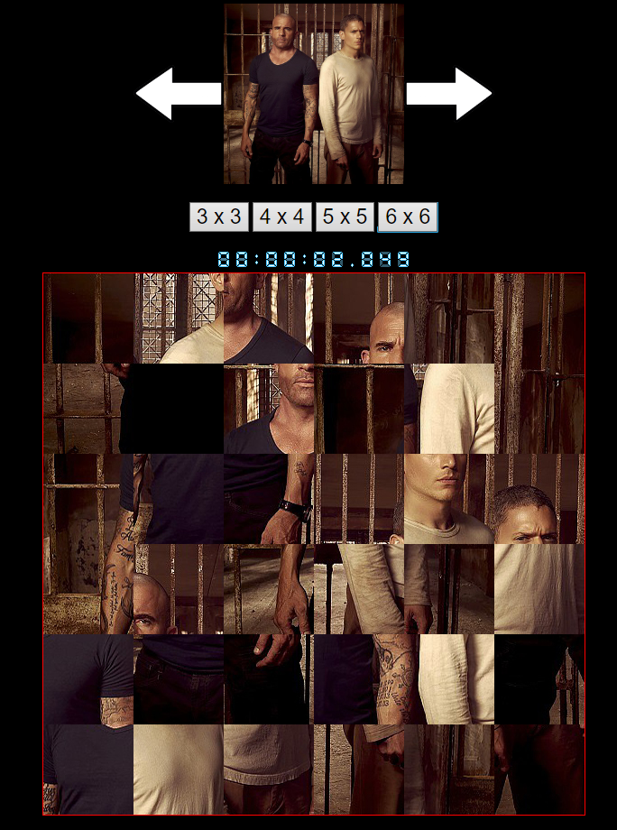

# Simple sliding puzzle

## This is my old school project, which I made with pure JavaScript. It contains sliding animations, timer and saving records in cookies.

  

## Run Locally:

Clone the repository and all you have to do is open index.html in your browser.